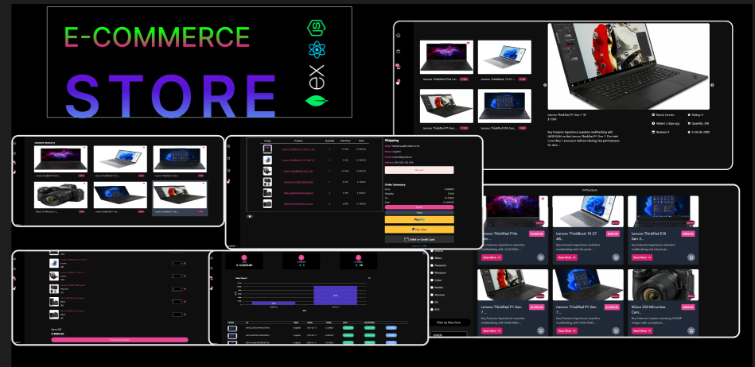

## 📦 Full-Stack E-commerce Application

A production-style full-stack e-commerce project built to practice real-world architecture, payments, and deployment workflows.

### 🚀 Tech Stack

- **Frontend:** React, Redux Toolkit, TypeScript
- **Backend:** Node.js, Express
- **Database:** MongoDB
- **Payments:** Stripe + PayPal (webhooks)
- **Media Uploads:** Cloudinary
- **DevOps:** Docker, modular project structure

### ✨ Features

- User authentication and authorization
- Product management (CRUD)
- Shopping cart and order workflow
- Secure payment processing with Stripe and PayPal
- PayPal webhook handling for automatic order updates
- Admin dashboard for store management
- Image upload and storage
- Global state management with Redux Toolkit

### 🧠 Key Learning Focus

- Designing a scalable full-stack architecture
- Implementing secure payment flows and verification
- Handling async backend events (webhooks → database → UI)
- Structuring a clean and maintainable codebase
- Simulating production-level deployment and environment setup

### 🎯 Goal

This project was built to simulate a **real production e-commerce system**, focusing on reliability, security, and maintainability rather than just UI features.

## 🏠 [The Original Project](https://www.youtube.com/watch?v=PRpTY5LS95M&list=PLSDeUiTMfxW5ymcWAXlbnJ3KLoN34Li_C"Youtub")

